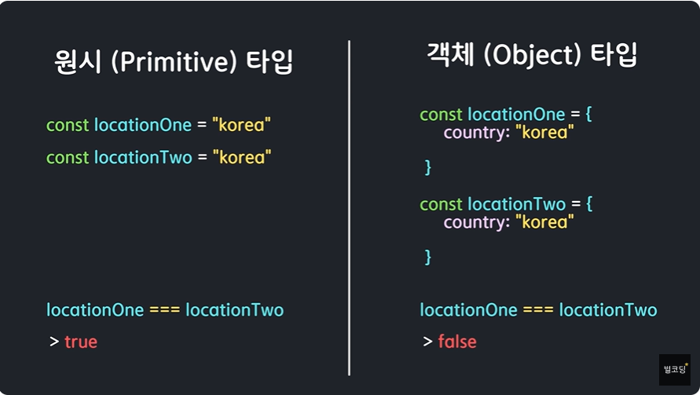

# 별코딩 useMemo 연습
컴포넌트 최적화 필요 (2가지 방법)
* useMemo
* useCallback

무엇인지 어떻게 컴포넌트 성능을 향상시키는지

## 함수형 컴포넌트
>함수형 컴포넌트가 렌더링 된다는 것은   
-> 함수형 컴포넌트가 호출된 것   
-> 모든 내부 변수 초기화   
```js
function Component(){
  const value = calculate();
  return <div>{value}</div>
}
<Component />
```

같은 연산을 반복하는 calculate()를 반복하기보다는
메모이제이션을 통해 효율을 높일 수 있음

>렌더링   
-> Component 함수호출, Memoization   
-> 렌더링   
-> Component 함수호출, Memoize된 값을 재사용   

***
### useMemo 기본뼈대
```js
/** 첫번째 매개변수로 콜백함수 두번째 매개변수로 배열 */
const value = useMemo(()=>{
  return calculate();
},[item])
// 두 번째 배열은 의존성 배열이라고도 불림
// [] 빈 배열을 넣을 경우 첫 번째 마운트 될때만 연산을하며
// 그 다음 연산은 동일한 값을 사용함
// 꼭 필요할때만 사용해야함
```

#### 쉬운계산기 때의 문제점
>함수형 컴포넌트이기에 쉬운 계산기를 돌려도   
어려운 계산기가 동시에 작동하여 1초정도 걸리게된다.

***

###### 자바스크립트 타입
* 원시타입
>String   
Number   
Boolean   
Null   
Undefined   
BigInt   
Symbol

* 객체 (Object) 타입
> 원시타입을 제외한 모든것   
Object
Array


각자의 객체 안에 있는 주소가 달라서 ===가 false가 나타남

따라서 객체를 만들때 useMemo를 사용해줘서 만들고   
특정 useState변수를 []에 넣음으로써 효율적으로 react를 동작시키를 수 있다.